# Cat Farm - Architecture Diagrams

Visual documentation of the Cat Farm game architecture showing relationships between components, hooks, and database tables.

---

## System Overview

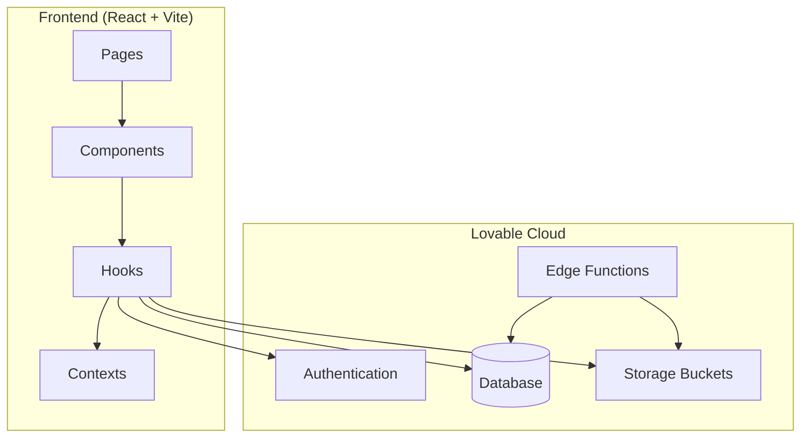

---

## Component Hierarchy

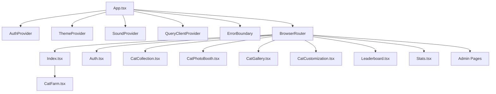

---

## Main Game Component Structure

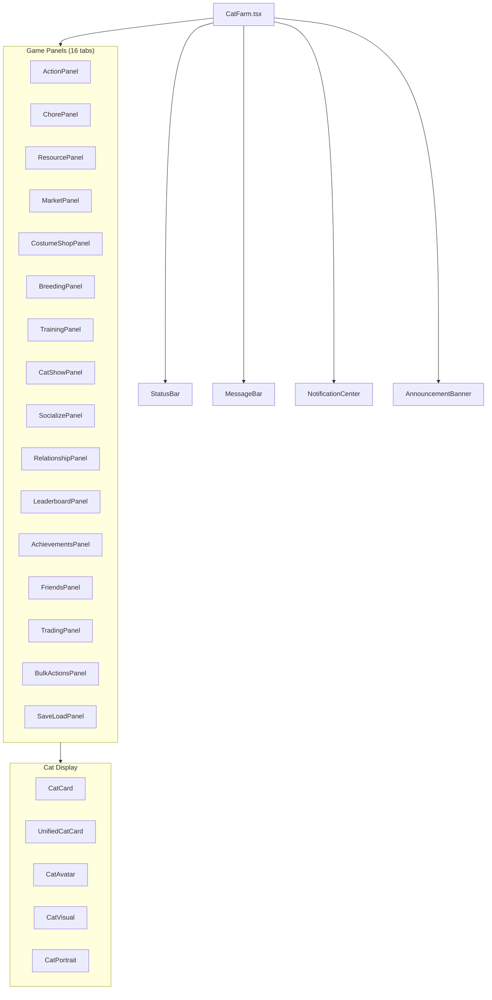

---

## Hooks Architecture

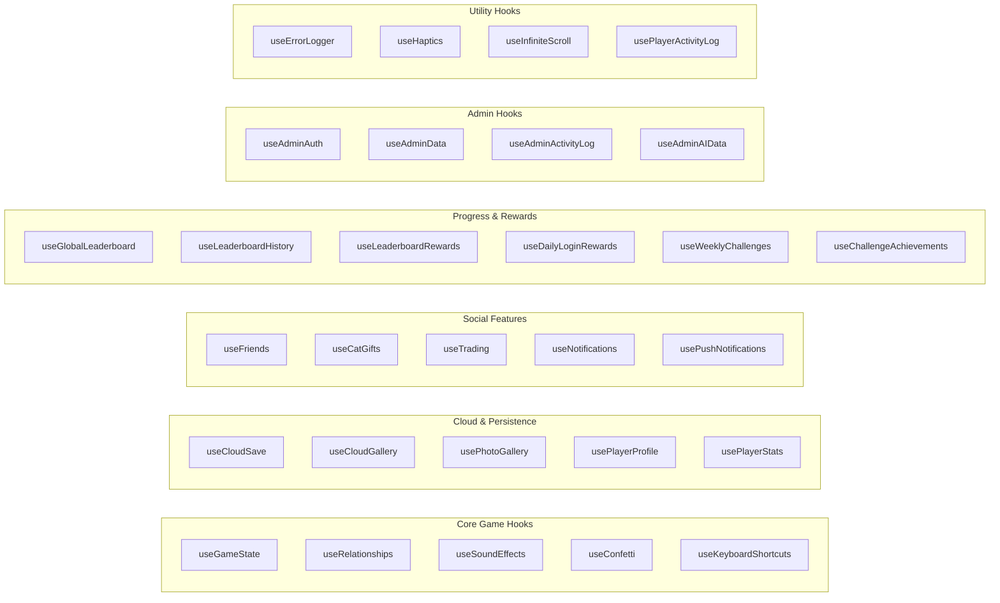

---

## Database Schema Relationships

```mermaid
erDiagram
    AUTH_USERS ||--|| PROFILES : "1:1"
    PROFILES ||--o{ GAME_SAVES : "has"
    PROFILES ||--o{ PLAYER_STATS : "has"
    PROFILES ||--o{ DAILY_LOGIN_REWARDS : "has"
    PROFILES ||--o{ GALLERY_PHOTOS : "owns"
    
    PROFILES ||--o{ PLAYER_FRIENDS : "sender"
    PROFILES ||--o{ PLAYER_FRIENDS : "recipient"
    
    PROFILES ||--o{ CAT_GIFTS : "sender"
    PROFILES ||--o{ CAT_GIFTS : "recipient"
    
    PROFILES ||--o{ TRADE_OFFERS : "sender"
    PROFILES ||--o{ TRADE_OFFERS : "recipient"
    
    PROFILES ||--o{ USER_ROLES : "has"
    PROFILES ||--o{ PUSH_SUBSCRIPTIONS : "has"
    PROFILES ||--o{ ERROR_LOGS : "generates"
    PROFILES ||--o{ PLAYER_ACTIVITY_LOG : "generates"
    
    WEEKLY_CHALLENGES ||--o{ PLAYER_CHALLENGE_PROGRESS : "tracks"
    PROFILES ||--o{ PLAYER_CHALLENGE_PROGRESS : "has"
    PROFILES ||--o{ PLAYER_CHALLENGE_STATS : "has"
    
    PROFILES ||--o{ LEADERBOARD_REWARDS : "receives"
    PROFILES ||--o{ LEADERBOARD_SNAPSHOTS : "has"
    PROFILES ||--o{ RANK_HISTORY : "has"
    
    PROFILES ||--o{ ADMIN_ACTIVITY_LOG : "admin actions"
    PROFILES ||--o{ AI_USAGE_LOG : "ai usage"

    PROFILES {
        uuid id PK
        text email
        text display_name
        text avatar_emoji
        text username
        timestamp suspended_at
    }
    
    GAME_SAVES {
        uuid id PK
        uuid user_id FK
        jsonb game_state
        int kittens_bred
        jsonb relationships
    }
    
    PLAYER_STATS {
        uuid id PK
        uuid user_id FK
        int total_show_wins
        int total_cats_owned
        int total_kittens_bred
    }
    
    PLAYER_FRIENDS {
        uuid id PK
        uuid user_id FK
        uuid friend_id FK
        text status
    }
    
    CAT_GIFTS {
        uuid id PK
        uuid sender_id FK
        uuid recipient_id FK
        jsonb cat_data
        text status
    }
    
    TRADE_OFFERS {
        uuid id PK
        uuid sender_id FK
        uuid recipient_id FK
        jsonb offered_cats
        int offered_money
        text status
    }
```

---

## Data Flow: Game State

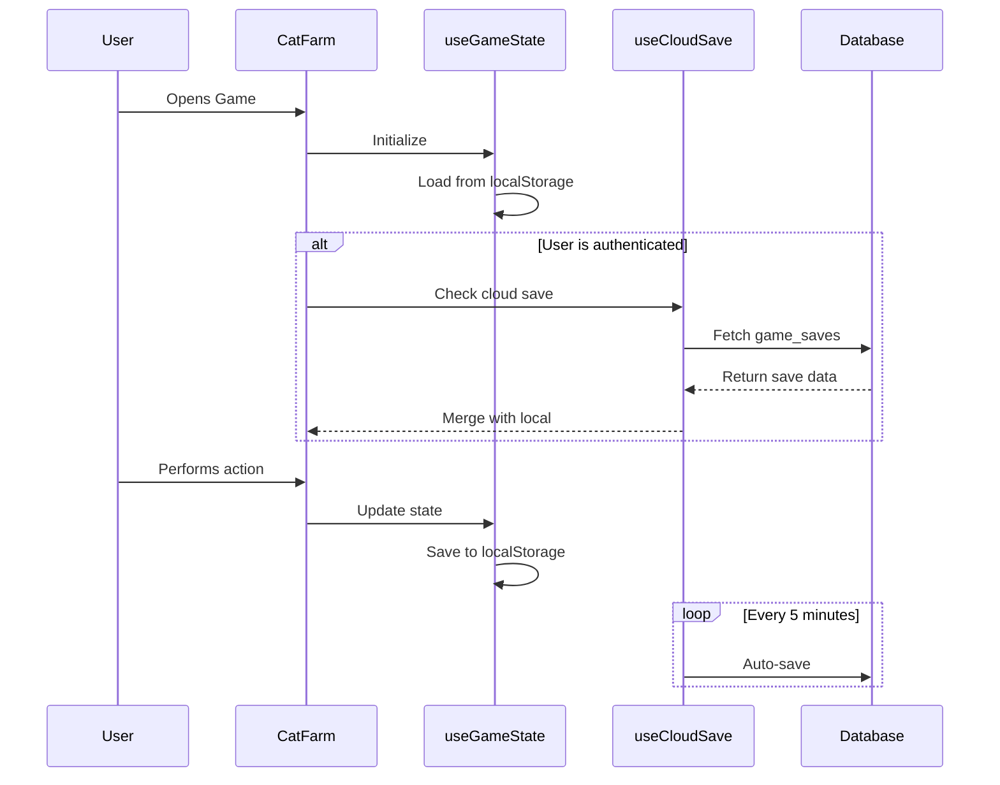

---

## Data Flow: Social Features

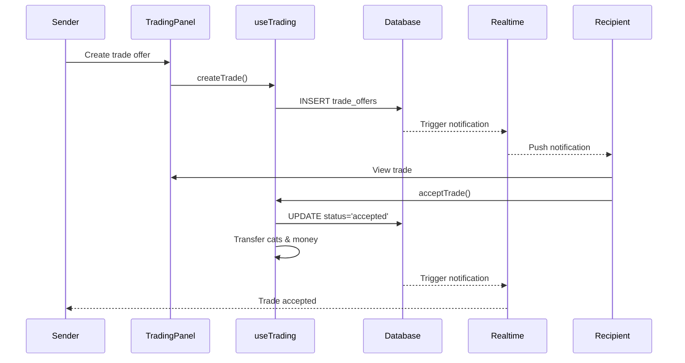

---

## Authentication Flow

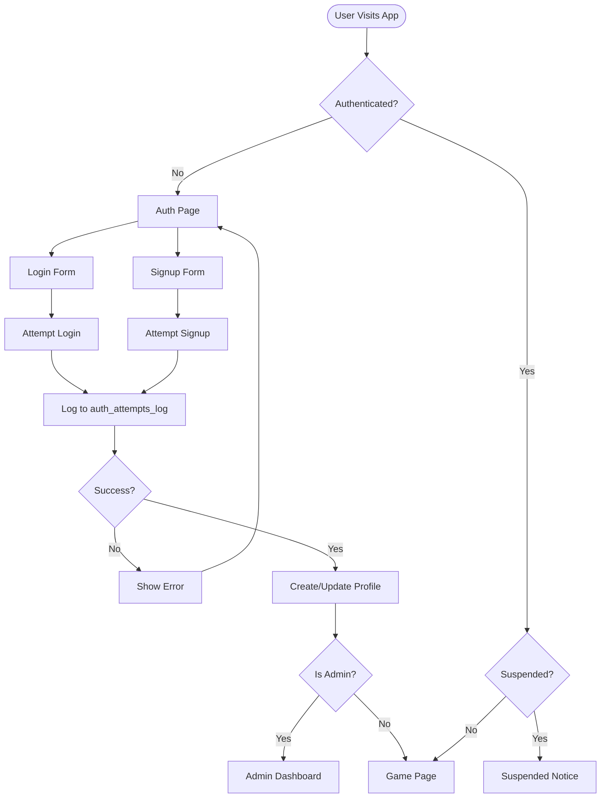

---

## Admin System Architecture

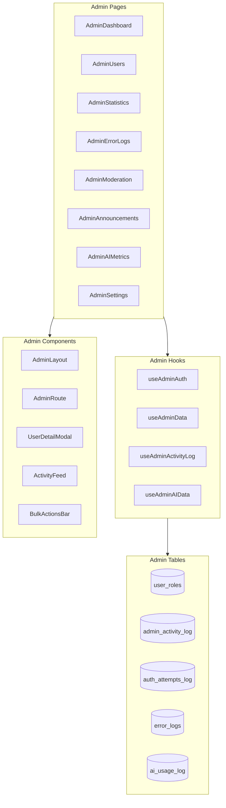

---

## Edge Functions

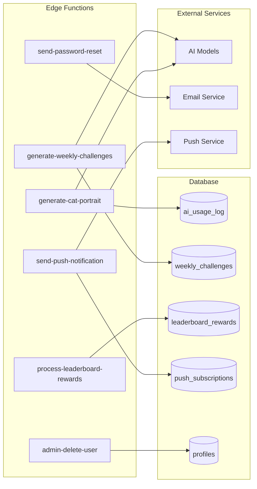

---

## Storage Architecture

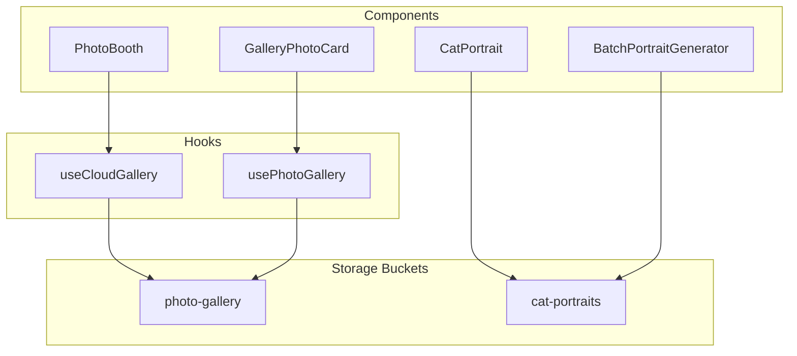

---

## Real-time Features

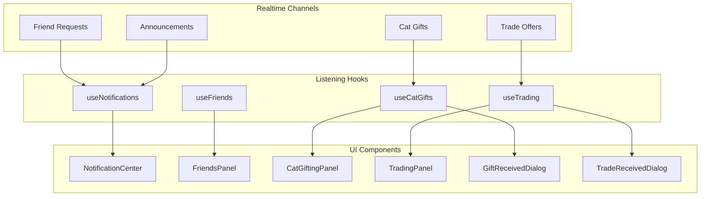

---

## Cat Data Model

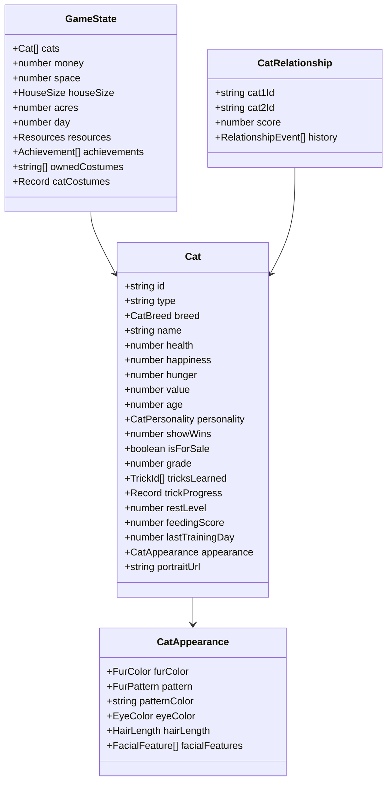

---

## VIP & Rewards System

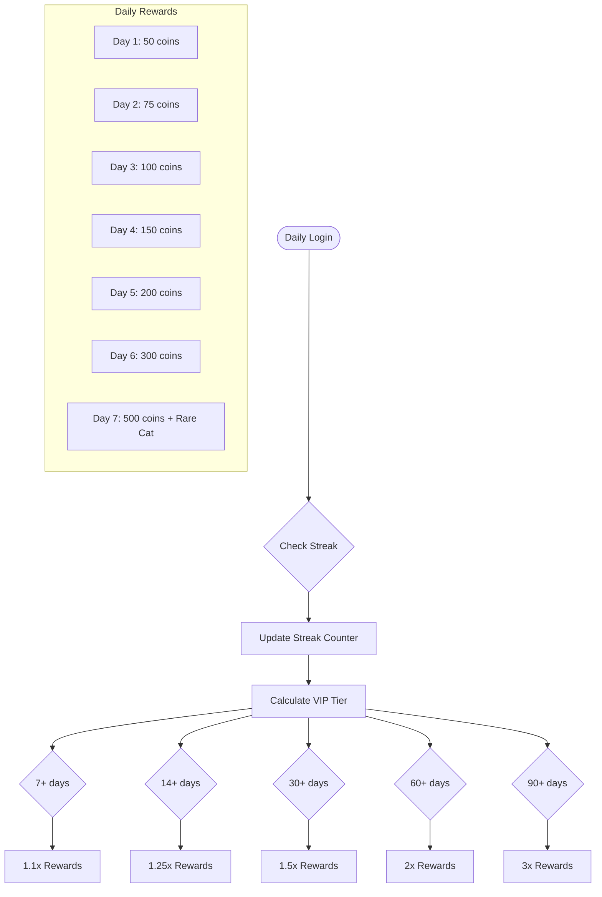

---

## Weekly Challenges Flow

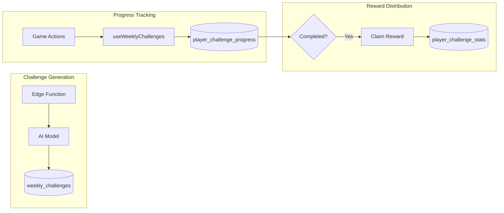

---

## File Structure Overview

```
src/
├── components/
│   ├── game/          # 45+ game components
│   ├── admin/         # 6 admin components
│   ├── stats/         # 6 statistics components
│   ├── ui/            # 50+ shadcn/ui components
│   ├── ErrorBoundary.tsx
│   └── ErrorLoggerProvider.tsx
├── hooks/             # 32 custom hooks
├── contexts/          # 3 React contexts
├── pages/             # 10 pages + 8 admin pages
├── types/             # 12 type definition files
├── lib/               # Utility functions
└── integrations/      # Supabase client & types

supabase/
├── functions/         # 6 edge functions
├── migrations/        # Database migrations
└── config.toml        # Supabase configuration

docs/                  # Documentation files
```
